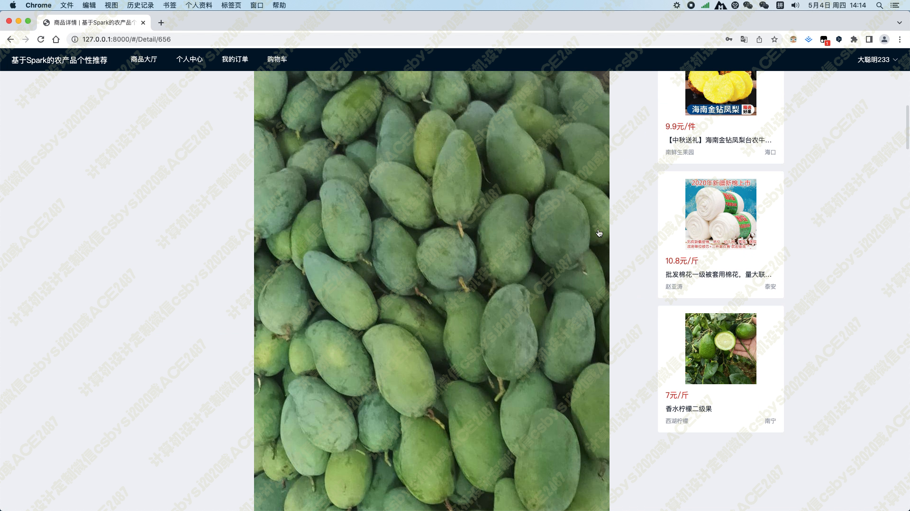

# 027 基于Spark协同过滤的农产品个性推荐系统-设计展示

> **代码有偿获取 可接受定制 微信联系方式: csbysj2020 或 ACE2487，备注(BS)**

> 

> 

## 介绍

本系统是一个基于Python技术栈开发的农产品在线交易平台。通过集成了pyspark、hadoop、django、scrapy、vue、element-plus等多个优秀开源框架，实现了全方位的功能覆盖，并采用了协同过滤算法为用户推荐相关农产品。

首先，我们使用Scrapy爬虫框架抓取惠农网站上的农产品数据，并将其存储到Hadoop分布式文件系统中。在此基础上，我们搭建了一个完整的农产品交易平台，支持用户注册和登录，以及管理员管理各类农产品数据。

用户登录后可以进入个人中心，在其中修改基本信息，包括收货人姓名、收货地址及联系电话，并且正确填写这些信息是保证能够准确收到货物的必要步骤。另外，用户也可以通过个人中心修改密码，保障账户安全。

管理员可以在后台管理各类农产品数据，包括添加、删除和修改商品信息，以及管理订单等操作。管理员也可以对特定用户进行数据操作权限控制，保障数据安全。

在商品大厅模块中，我们提供了农产品关键词和农产品分类两个筛选条件，以便用户能够快速查找感兴趣的农产品。同时，我们还提供了默认、价格和随便看看三种排序方式，让用户可以方便地对产品进行排序。在模块页面的右侧，我们使用基于用户的协同过滤算法为用户推荐5个农产品，这个推荐算法能够根据用户的历史行为和偏好，为用户推荐最符合其口味的商品。

当用户进入某个农产品的详情页面时，系统会展示农产品的标题、产品图片、价格、商家、类别、地区、产品参数以及产品详情介绍等基本信息。同时，在页面的右侧，我们使用基于物品的协同过滤算法为用户推荐5个相关的农产品，以帮助用户找到其可能感兴趣的其他商品。

在购物车页面，用户可以将所有农产品一并结算购买，并且填写完收货人姓名、收货地址及联系电话等信息后，加入订单信息，随后可在我的订单模块查看历史所有的订单。这个功能的实现，既方便了用户的购物体验，也提高了订单管理的效率。

总之，本系统集成了众多优秀开源框架和算法，为用户提供了全面而优质的在线交易服务。我们相信，这个系统将能够帮助用户更方便地获取到自己所需要的农产品，并且促进了农产品交易的信息化和智能化。

## 技术及功能关键词

python pyspark hadoop django scrapy vue element-plus 协同过滤算法 
通过scrapy爬虫框架抓取“惠农网”网站上的农产品数据 
前台用户通过登陆注册后进入系统
用户可在个人中心修改基本信息，其包括收货人姓名、收货地址及联系电话，也可以修改密码 
管理员可在后台管理各类农产品数据 
在商品大厅模块中，在模块页面的左侧，用户可以通过农产品关键词或农产品分类等条件筛选符合要求的农产品，也可以通过默认、价格、随便看看等排序条件对产品进行排序；在模块页面的右侧，系统会通过基于用户的协同过滤算法推荐用户5个农产品
当用户浏览某个农产品的详情页面时，系统会展示农产品的标题、产品图片、价格、商家、类别、地区、产品参数以及产品详情介绍等基本信息，同时在页面的右侧，系统会通过基于物品的协同过滤算法推荐用户5个相关的农产品
当用户浏览某个农产品的详情页面时，用户可将其加入购物车，在购物车页面可以将所有农产品一并结算购买，当填写完收货人姓名、收货地址及联系电话等信息后，加入订单信息，随后可在我的订单模块查看历史所有的订单

## 视频

> **点击查看 \>\>\> [https://www.bilibili.com/video/BV1hV4y1d7Za/](https://www.bilibili.com/video/BV1hV4y1d7Za/)**

## 截图

